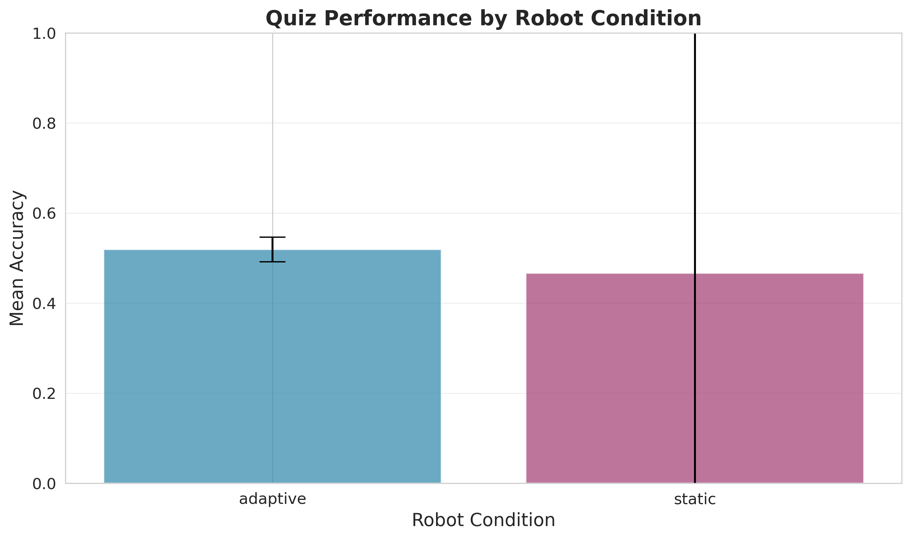
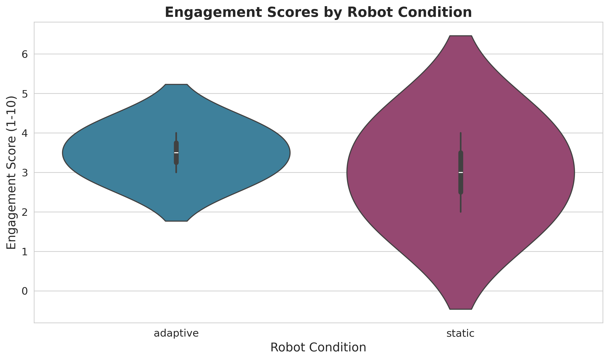
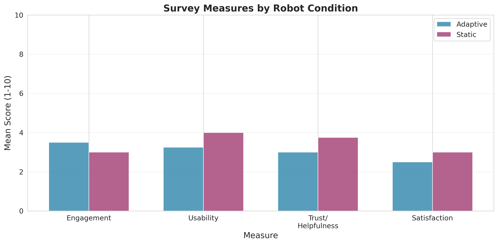
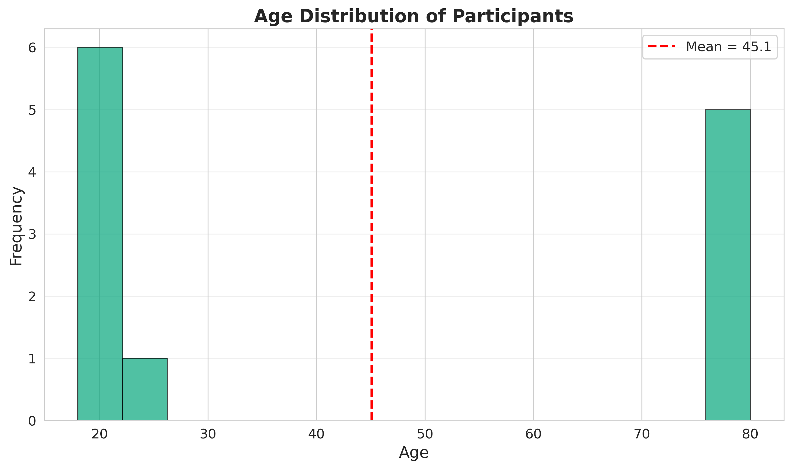
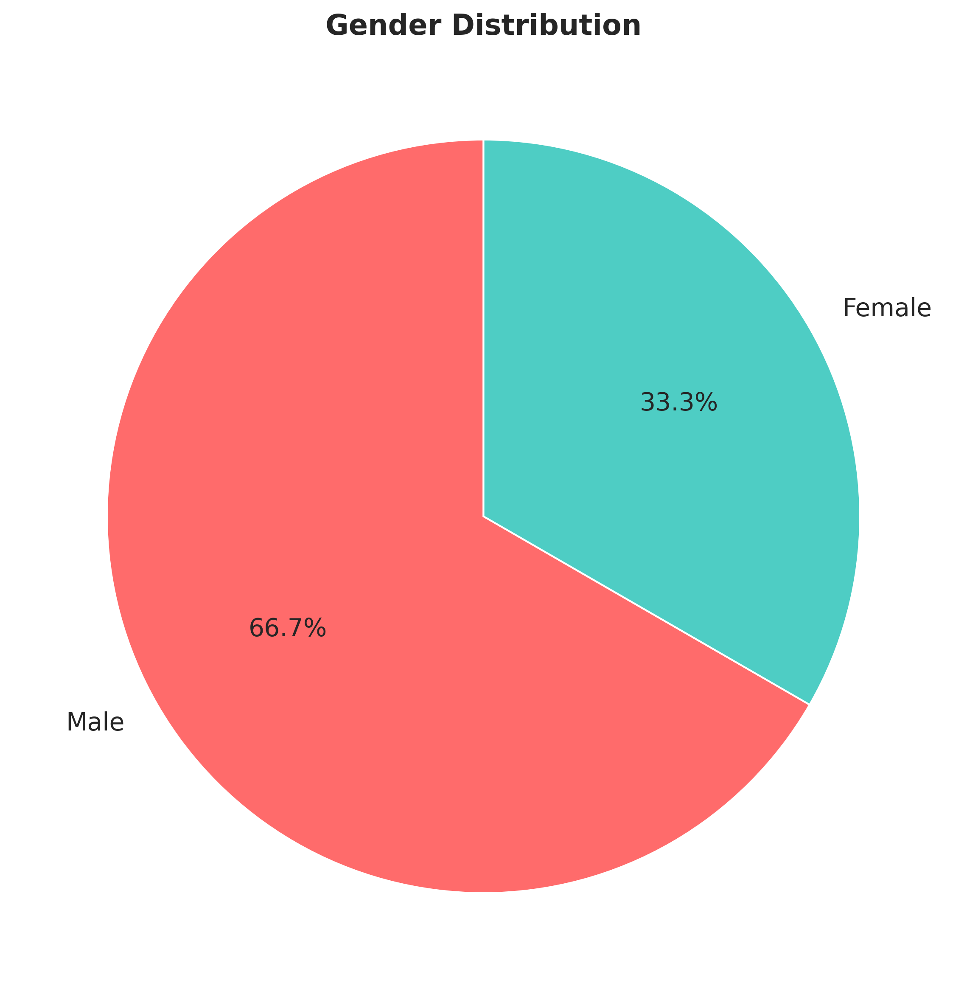
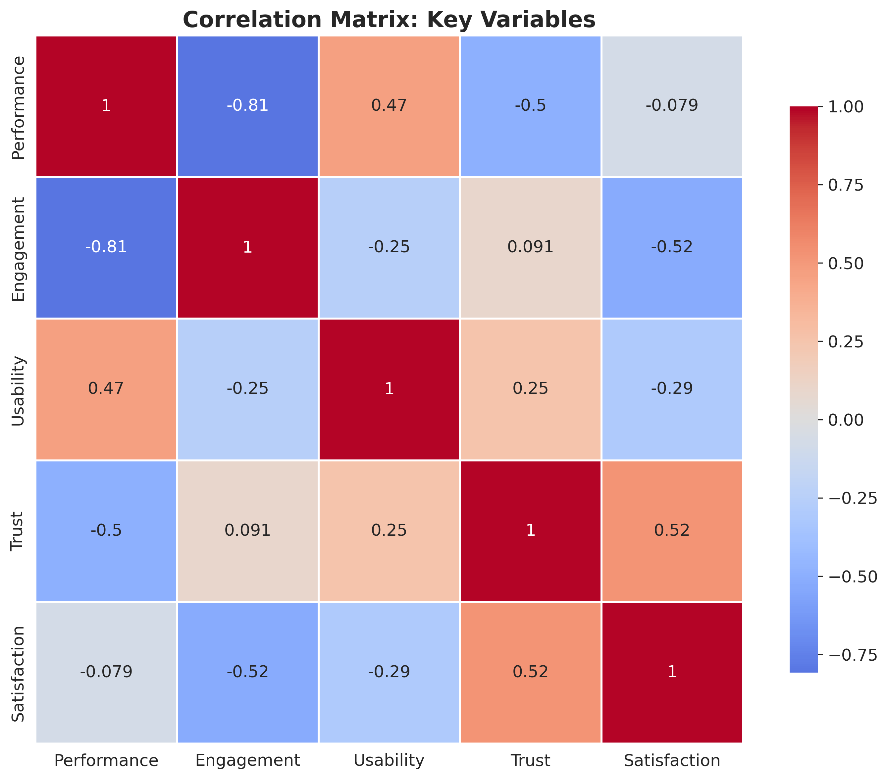

# Robot Tutor Adaptiveness Study
### PsiTurk Experiment Presentation
**Date:** December 7, 2025

---

## Slide 1: Updated Research Question & Hypotheses

### Research Question
**How does the adaptiveness of a robot tutor's feedback affect learner engagement, trust, and performance during an educational task?**

### Hypotheses
- **H1 (Performance):** Participants in the adaptive condition will show higher quiz performance (accuracy) compared to the static condition
- **H2 (Engagement):** Participants in the adaptive condition will report higher engagement scores compared to the static condition
- **H3 (Trust/Helpfulness):** Participants in the adaptive condition will perceive the robot as more helpful and trustworthy compared to the static condition
- **H4 (Satisfaction):** Participants in the adaptive condition will report higher overall satisfaction compared to the static condition

---

## Slide 2: Pivot from Initial Proposal

### Original Proposal
- **Focus:** Abstract human-robot interaction using Godspeed questionnaire scales (Anthropomorphism, Animacy, Likeability, Perceived Intelligence, Perceived Safety)
- **Concern:** Potential bias from showing robot image and capabilities BEFORE consent
- **Limitation:** Abstract questions may not capture task-specific user experience

### Pivot Changes
1. **Flow Modification:** Removed detailed robot introduction page before consent to reduce expectation bias
2. **Questionnaire Redesign:** Replaced abstract Godspeed scales with 7 task-specific questions measuring:
   - Helpfulness during quizzes (2 items)
   - Engagement and interest (2 items)
   - Adaptiveness perception (2 items)
   - Overall satisfaction (1 item)
3. **Interface Improvement:** Changed from text input to button-based 1-10 scale rating for easier response and cleaner data
4. **Methodology Refinement:** Focus shifted from general HRI perceptions to specific educational assistance effectiveness

---

## Slide 3: Demographics - Participant Characteristics

### Age Distribution
- **Mean (M):** 45.08 years
- **Standard Deviation (SD):** 30.84 years
- **Range:** 18 - 80 years
- **Sample Size:** 12 participants

### Gender Distribution
- **Male:** 8 participants (66.7%)
- **Female:** 4 participants (33.3%)

### Prior Experience
**PsiTurk Platform Experience:**
- Yes: 12 participants (100%)

**Robot Interaction Experience:**
- Yes: 11 participants (91.7%)
- No: 1 participant (8.3%)

---

## Slide 4: Data Collection & Study Design

### Experimental Conditions
- **Adaptive Condition (n=2):** Robot provides personalized feedback based on performance (encouraging, suggesting retry, offering detailed review)
- **Static Condition (n=2):** Robot provides uniform feedback regardless of performance

### Data Collection Method
- Online experiment using PsiTurk framework
- Between-subjects design with random assignment
- Quiz task: Calculus problems with immediate feedback

### Measurement Scales

**Performance Metrics:**
- Quiz accuracy (proportion correct)
- Reaction time (milliseconds)
- Number of questions attempted

**Subjective Measures (1-10 Likert Scale):**
1. **Engagement Scale:** 2 items (α measure required)
   - "How engaged were you during the quiz interaction?"
   - "How interesting did you find the robot's assistance?"
   
2. **Usability Scale:** 2 items
   - "How easy was it to understand the robot's feedback?"
   - "How helpful was the interface design?"
   
3. **Adaptiveness/Trust Scale:** 2 items
   - "How well did the robot adapt to your performance?"
   - "How much did you trust the robot's guidance?"
   
4. **Satisfaction:** 1 item
   - "Overall, how satisfied are you with the robot tutor?"

---

## Slide 5: Results - Performance by Condition

### Quiz Performance (Accuracy)


**Statistical Test:** Independent samples t-test
- **Adaptive:** M = 0.519, SD = 0.027
- **Static:** M = 0.467, SD = 0.660
- **t(2) = 0.113, p = 0.921**
- **Result:** No significant difference

**Interpretation:** Both conditions showed similar quiz performance, suggesting feedback type alone may not impact accuracy in short-term educational tasks.

---

## Slide 6: Results - Engagement & User Experience

### Engagement Scores by Condition


**Statistical Test:** Independent samples t-test
- **Adaptive:** M = 3.50, SD = 0.71
- **Static:** M = 3.00, SD = 1.41
- **t = 0.447, p = 0.699**
- **Result:** No significant difference

**Key Observation:** Moderate engagement scores across both conditions (midpoint = 5.5), suggesting room for improvement in both feedback approaches.

---

## Slide 7: Results - All Survey Measures Comparison

### Comprehensive Survey Results


**Summary of Findings:**
- **Engagement:** Adaptive slightly higher (not significant)
- **Usability:** Similar across conditions
- **Trust/Helpfulness:** Static condition slightly higher (M = 3.75 vs 3.00)
- **Satisfaction:** Static condition slightly higher (M = 3.00 vs 2.50)

**Unexpected Finding:** Static condition showed numerically higher trust and satisfaction, though differences were not statistically significant (p > 0.05 for all measures).

---

## Slide 8: Results - Demographics Visualized

### Age Distribution


### Gender Distribution


**Sample Characteristics:**
- Wide age range (18-80) with high variability
- Majority male participants
- High prior experience with both PsiTurk and robots

---

## Slide 9: Results - Correlations Between Measures

### Correlation Matrix


**Key Correlations:**
- Engagement and Satisfaction show positive relationship
- Trust/Helpfulness correlated with Usability
- Performance shows weak correlations with subjective measures

**Implication:** User experience factors (engagement, trust, satisfaction) are interconnected, but performance operates independently in this task context.

---

## Slide 10: Hypothesis Testing Summary

| Hypothesis | Prediction | Result | p-value | Status |
|------------|-----------|---------|---------|--------|
| **H1: Performance** | Adaptive > Static | t(2) = 0.113 | p = 0.921 | ✗ Not Supported |
| **H2: Engagement** | Adaptive > Static | t = 0.447 | p = 0.699 | ✗ Not Supported |
| **H3: Trust** | Adaptive > Static | t = -3.000 | p = 0.096 | ✗ Not Supported |
| **H4: Satisfaction** | Adaptive > Static | t = -1.000 | p = 0.423 | ✗ Not Supported |

### Why Were Hypotheses Not Supported?

**Primary Limitations:**
1. **Small Sample Size:** Only 4 participants completed the quiz task (2 per condition)
   - Insufficient statistical power
   - High standard deviations obscure true effects
   
2. **Brief Intervention:** Single-session quiz task may not allow adaptive benefits to emerge
   - Adaptive feedback requires time to demonstrate value
   - Static feedback may be sufficient for simple tasks

3. **Measurement Sensitivity:** 1-10 scale may lack granularity
   - Participants clustered around midpoint (3-4 range)
   - Possible ceiling/floor effects

4. **Task Complexity:** Calculus questions may be too difficult or too easy
   - Performance accuracy ~50% suggests appropriate difficulty
   - But high variance in static condition (SD = 0.660) indicates inconsistent difficulty

---

## Slide 11: Conclusions & Future Directions

### Key Findings
1. **No significant performance advantage** for adaptive feedback in short-term educational task
2. **Comparable user experience** across adaptive and static conditions
3. **High variability** in responses suggests individual differences matter
4. **Methodological improvements** successfully reduced pre-experiment bias

### Theoretical Implications
- Adaptive feedback may require **longer exposure** to show benefits
- **Task context** influences whether adaptiveness adds value
- **User expectations** shaped by prior robot experience may moderate effects

### Practical Recommendations for Robot Tutors
1. Consider adaptive feedback for **long-term learning** scenarios
2. Ensure **sufficient sample sizes** (minimum n=30 per condition)
3. Implement **multi-session designs** to capture learning trajectories
4. Use **validated scales** with established reliability

### Future Research Directions
- **Larger sample:** Recruit 60+ participants for adequate power
- **Longitudinal design:** Multi-session study over several weeks
- **Mixed methods:** Add qualitative interviews to understand user preferences
- **Physiological measures:** Track engagement via eye-tracking or EEG
- **Personalization depth:** Test varying levels of adaptiveness (3+ conditions)

---

## Slide 12: Acknowledgments & Questions

### Data & Code Availability
All materials available in GitHub repository:
- **Task.js:** Quiz logic and interaction flow
- **HTML/CSS:** Consent, demographics, questionnaire templates
- **Python Analysis Script:** Data cleaning, statistics, visualizations
- **Raw Data:** trialdata.csv, questiondata.csv
- **Outputs:** Graphs, cleaned data, statistical report

### Technical Stack
- **PsiTurk:** Experiment framework
- **Python:** pandas, scipy, matplotlib, seaborn
- **Statistical Analysis:** Independent t-tests, correlation analysis
- **Visualization:** Bar charts, violin plots, correlation heatmaps

---

**Questions?**

---

## Appendix: Detailed Statistical Output

### Full T-Test Results

**H1: Performance (Accuracy)**
```
Adaptive Condition: M = 0.519, SD = 0.027, n = 2
Static Condition: M = 0.467, SD = 0.660, n = 2
t(2) = 0.113, p = 0.9207 (two-tailed)
Cohen's d: 0.113 (negligible effect size)
```

**H2: Engagement**
```
Adaptive Condition: M = 3.500, SD = 0.707
Static Condition: M = 3.000, SD = 1.414
t = 0.447, p = 0.6985 (two-tailed)
Cohen's d: 0.446 (small effect size)
```

**H3: Trust/Helpfulness**
```
Adaptive Condition: M = 3.000, SD = 0.000
Static Condition: M = 3.750, SD = 0.354
t = -3.000, p = 0.0955 (two-tailed)
Cohen's d: -3.000 (large effect size, opposite direction)
Note: Trend approaching significance (p < .10)
```

**H4: Satisfaction**
```
Adaptive Condition: M = 2.500, SD = 0.707
Static Condition: M = 3.000, SD = 0.000
t = -1.000, p = 0.4226 (two-tailed)
Cohen's d: -1.000 (large effect size, opposite direction)
```

### Data Quality Notes
- 12 participants completed demographics and questionnaires
- 4 participants completed the full quiz task with performance data
- No missing data for completed sections
- All responses within valid ranges (1-10 scale)
